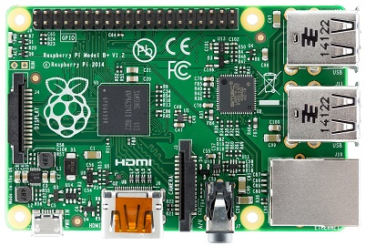
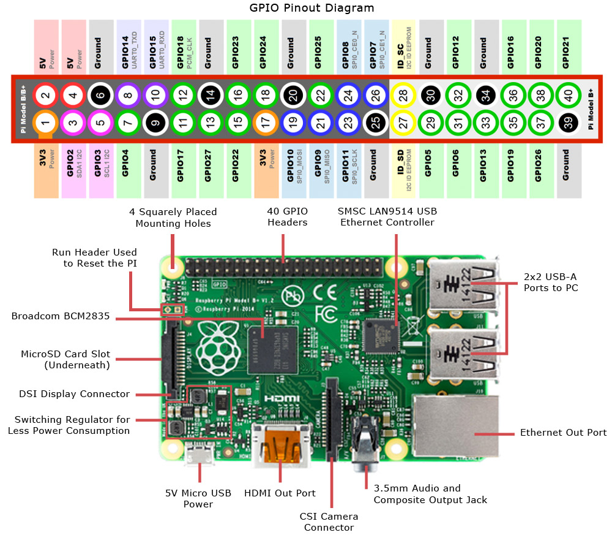

****
# День 1 <a name="day1"></a>

## Raspberry Pi <a name="21"></a>
> Raspberry Pi — одноплатный компьютер размером с банковскую карту, изначально разработанный как бюджетная система для обучения информатике, 
впоследствии получивший намного более широкое применение и популярность, чем ожидали его авторы. 
>



**Raspberry PI**

На плате размером с кредитную карту вы найдёте всё то, что можете найти в обычном персональном компьютере: процессор, оперативную память, 
разъёмы HDMI, USB, Ethernet, аналоговые аудио- и видеовыходы. Кроме того, на плате расположены 40 контактов ввода/вывода общего назначения. К 
ним вы сможете подключать периферию для взаимодействия с внешним миром: исполнительные устройства вроде реле и сервомоторов или же любые 
сенсоры; в общем всё, что работает от электричества.

Штатной операционной системой для Raspberry Pi является Linux. Она устанавливается на micro-SD карту, а та в свою очередь — в специальном 
слоте на плате. Если вы не знаете Linux, не стоит пугаться. Напротив: этот компьютер — прекрасная возможность во всём разобраться. Потерять 
данные или сильно напортачить с настройками не так страшно, ведь образ на SD-карте можно восстановить за считанные минуты. После этого можно 
продолжить эксперименты с чистого листа или с определённой контрольной точки.

****
## Порты и аппаратные интерфейсы <a name="22"></a>

Для подключения монитора или телевизора используются композитный видеовыход или разъём HDMI. Кроме того, заводские OEM ЖК-экраны могут быть 
подключены через интерфейс DSI.
Raspberry Pi 2 Model B предоставляет 4 USB-порта, объединённых внутренним хабом. К ним, помимо всего прочего, можно подключить клавиатуру и 
мышь.

В качестве низкоуровневых интерфейсов доступны:

- 40 портов ввода-вывода общего назначения
- UART (Serial)
- Шина I²C/TWI
- Шина SPI с селектором между двумя устройствами
- Пины питания: 3,3 В, 5 В и земля

Колонки или наушники могут быть подключены через стандартное гнездо для 3,5 мм джеков. Также звук может передаваться через интерфейс HDMI.
На Raspberry Pi Model B+ доступен Ethernet-адаптер на 10/100 Мбит с выходом на стандартное гнездо 8P8C (RJ45).

****
## Распиновка платы <a name="23"></a>


**Распиновка Raspberry**

****
## Питание <a name="24"></a>

Raspberry Pi Model B+ может быть запитана через microUSB-кабель или через пины питания.
Номинальное напряжение питания — 5 В. Компьютер потребляет до 800 мА без внешних устройств.
Аппаратный выключатель питания на плате отсутствует. Для включения компьютера достаточно просто подсоединить кабель питания. Для выключения 
используйте штатную функцию операционной системы.

****
## Разбор тестового примера:<a name="25"></a> 

Берем Raspberry и аккуратно достаем карту памяти из прозрачного бокса.


Прежде всего нужно установить SD-карту с операционной системой Raspbian в соответствущее гнездо на плате Raspberry. В гнезде плата фиксируется 
благодаря блокирующему механизму. Для надежного закрепления нужно аккуратно вдавить пальцем карту в гнездо.


****
## Настройка SSH соединения с Raspberry Pi <a name="26"></a>

Используя ОС Linux выполнить подключение к RPi можно следующим образом:

```sh
ssh pi@XX.XX.XX.XX
```

где XX.XX.XX.XX - ранее определенный ip адрес устройства. 

Если вы работаете в ОС Windows, то вам нужно воспользоваться программой Putty.
В поле Имя хоста указываем ip адрес Raspberry в сети, порт 22 и тип подключения SSH.

Пароль пользователя pi: raspberry

****
## Как узнать адрес Raspberry? <a name="27"></a>

* В Ubuntu выполните команду *sudo nmap –sn < ip-адрес компьютера >/< маска >*.  Пример:

 *sudo nmap -sn 192.168.1.0/24 -p 22*

* В Windows скачайте любое приложение, сканирующее адреса (к примеру, Advanced IP Scanner). Просканируйте сеть, в которой находится компьютер.
* В списке найдите устройство с именем, подобным “Raspberry PI”.
Если вы обнаружите несоклько микрокомпьютеров “Raspberry PI” в вашей сети, вам понадобится узнать т.н. MAC адрес устройства - уникальный идентификатор сетевого устройства, состоящий из 6 байт. Узнать его можно по команде:

```shell
$ ifconfig
$ eth0      Link encap:Ethernet  HWaddr `28:d2:44:69:2a:c8` 
```

Также вы можете определить вашу плату по уникальному имени устройства `hostname` в файле /etc/hosname:
```shell
$ cat /etc/hostame
$ host10
```
Для удобства мы написали последние 6 цифр MAC адреса на разъеме Ethernet вашей платы.
В исключительном случае вы можете обнаружить вашу плату опытным путем, отключая и подключая свой Pi к сети.


****
## Полезные команды для работы в ОС Raspbian <a name="28"></a>

-   "top" — запуск предустановленного в Raspbian диспетчера задач;
-   "sudo raspi-config" — запуск первоначального меню настроек;
-   "sudo passwd root" — создание пароля для пользователя root;
-   "startx" — запуск графической оболочки;
-   "sudo halt" — выключение RPi;
-   "logout" — выход из системы;
-   "sudo reboot" — перезагрузка RPi;
-   "cd" — переход в необходимую директорию, например, для перехода в директорию /etc/network/ - "cd /etc/network/"
-   "pwd" — путь до текущей директории;
-   "dir" — содержимое текущей директории;
-   "mkdir" — создание директории. Например, "mkdir /home/pitest/" создаст директорию "pitest";
-   "rmdir" — удаление директории. Например, "mdir /home/pitest/" - удаление директории "pitest";
-   "cat" — открыть файл для чтения. Например, "cat /etc/network/interfaces" покажет содержимое файла "interfaces";
-   "nano" — открыть файл для редактирования. Например, "nano
-   /etc/network/interfaces" откроет для редактирования файл "interfaces";
-   "ifconfig" — отобразит текущую конфигурацию сети;
-   "df" — выведет в консоли свободное и используемое дисковое пространство для всех разделов файловой системы;
-   "clear" — очистить экран терминала;
-   "Ctrl"+"Ins" — скопировать выделенное (текст);
-   "Shift"+"Ins" — вставить из буфера (текст);
-   "sudo" — выполнения команд c правами root пользователя. Например, это актуально, если вы зашли под пользователем "pi" и хотите из консоли 
отредактировать какой-нибудь системный файл - "sudo nano путь_до_файла";
-   "Ctrl"+"C" — остановка текущего действия/выход из консольного приложения;
-   "sudo apt-get update" — обновление списка доступных пакетов;
-   "sudo apt-get upgrade" — обновление установленных пакетов;
-   "sudo apt-get install" — установка необходимого пакета. Например, для
установки консольного браузера Links вводим "sudo apt-get install links".

****
##Установка программного обеспечения для точки доступа WiFi <a name="29"></a>
Для начала установим dhcp-сервер и программное обеспечение hostapd для организации беспроводной точки доступа

```sh
sudo apt-get update
sudo apt-get install hostapd isc-dhcp-server
```

****
## Настройка dhcp-сервера <a name="2a"></a>

Правим файл /etc/dhcp/dhcpd.conf:

```sh
sudo nano /etc/dhcp/dhcpd.conf
```

Находим строки

option domain-name "example.org";
option domain-name-servers ns1.example.org, ns2.example.org;

и меняем их закомментировав решеткой #

```sh
 #option domain-name "example.org";
 #option domain-name-servers ns1.example.org, ns2.example.org;
```

Раскомментируем следующую строку:

```sh
 # If this DHCP server is the official DHCP server for the local
 # network, the authoritative directive should be uncommented.
 authoritative;
```

Добавляем настройки WiFi сети:

```sh
subnet 192.168.1.0 netmask 255.255.255.0 {
range 192.168.1.10 192.168.1.50;
option broadcast-address 192.168.1.255;
option routers 192.168.1.1;
default-lease-time 600;
max-lease-time 7200;
option domain-name "local";
option domain-name-servers 8.8.8.8, 8.8.4.4;
}
```

Сохраняем файл. 

Далее правим файл /etc/default/isc-dhcp-server

```sh
sudo nano /etc/default/isc-dhcp-server
```

Указываем имя интерфейсав строке:

```sh
INTERFACES=”wlan0″
```

Сохраняем и закрываем файл.

Далее отключаем wlan0

```sh
sudo ifdown wlan0
sudo nano /etc/network/interfaces
```

Вместо ```auto wlan0```, записываем:


```sh
iface wlan0 inet static
address 192.168.1.1
netmask 255.255.255.0
```

Сохраняем и закрываем файл.

```sh
sudo service networking restart
```

****
## Настройка точки доступа WiFi <a name="2b"></a>


Устанавливаем настройки точки доступа. Создадим новый кофигурацийний файл

```sh
sudo nano /etc/hostapd/hostapd.conf
```

В файл запишем следующие строки:

```sh
interface=wlan0
driver=rtl871xdrv
ssid=hackathon_team_001_ssid !!! Укажите уникальное ssid вашей сети
hw_mode=g
channel=6
macaddr_acl=0
auth_algs=1
ignore_broadcast_ssid=0
wpa=2
wpa_passphrase=hackathon_team_001_passwd !!! Укажите пароль 
wpa_key_mgmt=WPA-PSK
wpa_pairwise=TKIP
rsn_pairwise=CCMP
```

Сохраняем и закрываем.

Разрешаем использование конфигурационного файл:

```sh
sudo nano /etc/default/hostapd
```

Правим строку:

```sh
DAEMON_CONF=”/etc/hostapd/hostapd.conf”.
```

Сохраняем файл.


****
## Настройка NAT (Network Address Translation) и тестирование <a name="2c"></a>

Установка NAT позволит многим клиентам подключаться к WiFi и получать все данные через единую Ethernet IP.

```sh
sudo nano /etc/sysctl.conf
```

Добавляем в конец net.ipv4.ip_forward=1. 

Сохраняем.

Разрешаем форвардинг пакетов ip4.

```sh
sudo sh -c "echo 1 > /proc/sys/net/ipv4/ip_forward"
```

Запускаем следующие команды для настройки сетевой трансляции между ethernet портом eth0 и wifi портом wlan0. 

```sh
sudo iptables -t nat -A POSTROUTING -o eth0 -j MASQUERADE
sudo iptables -A FORWARD -i eth0 -o wlan0 -m state --state RELATED,ESTABLISHED -j ACCEPT
sudo iptables -A FORWARD -i wlan0 -o eth0 -j ACCEPT
```

Проверяем таблицы:

```sh
sudo iptables -t nat -S
sudo iptables -S
```

Сохраняем настройки iptables и разрешаем автоматическую загрузку настроек:

```sh
sudo sh -c "iptables-save > /etc/iptables.ipv4.nat"
```

Далее:

```sh
sudo nano /etc/network/interfaces 
```

Добавляем в конец файла:

```sh
up iptables-restore < /etc/iptables.ipv4.nat
```

Запускаем точку доступа:

```sh
sudo /usr/sbin/hostapd /etc/hostapd/hostapd.conf
```

После этого указанная Вами точка доступа должна появиться в списке доступных WiFi сетей. Вы можете подключить ваш Raspberry Pi к сети Internet кабелем Ethernet.
Если на ноутбуке или смартфоне, подключенном к Raspberry Pi удается загрузить страницу в браузере, настройка выполнено верно. 

Настрои автоматический запуск WiFi при загрузке Raspbery Pi:

```sh
sudo service hostapd start
sudo service isc-dhcp-server start
sudo update-rc.d hostapd enable
sudo update-rc.d isc-dhcp-server enable
```

****
## Установка Node.js на Raspberry Pi <a name="2d"></a>

В этом задании нам необходимо разработать и запустить клиент-серверного приложение, используя Raspberry Pi в качестве сервера, компьютер или смартфон в качестве клиента.
Клиент и сервер будут находиться в одной локальной сети WiFi, настроенной нами ранее.

В качестве серверного узла выступает (Node.js + Express),
в качестве клиента - браузер (js + html).


Для этого выполните команды для установки Node.js:

```sh
sudo apt-get update
sudo apt-get install nodejs
```

Проверьте, установились ли пакеты:
```sh
node -v
v8.4.0
npm -v
5.3.0
```

Если пакет `npm` (Node.js Package Manager) не установлен и не показывает версию,
то необходимо его установить отдельно командой `sudo apt-get install npm`

## Запуск hello-сервера на Raspberry Pi <a name="2e"></a>

1. Создайте папку `hello`: ```sh mkdir hello```
2. Перейдите в нее и выполните команду `npm init` (все опции оставлять по умолчанию)
В вашей папке появился файл `package.json`, в нем будут храниться зависимости проекта и параметры запуска.
3. Далее необходимо установить веб-фреймворк `Express` для обработки запросов, маршрутизации и раздачи статики.
`npm install express --save` (`--save` сохранит зависимость в `package .json`, в нем появилась строчка `"dependencies": {"express": "^4.16.4"}`)

```json
{
  "name": "hello",
  "version": "1.0.0",
  "description": "",
  "main": "index.js",
  "scripts": {
    "test": "echo \"Error: no test specified\" && exit 1"
  },
  "author": "",
  "license": "ISC",
  "dependencies": {
    "express": "^4.16.4"
  }
}
```
4. Создайте файл с кодом сервера `index.js`

```js
"use strict";

// подключаем фреймвок express
let express = require('express');
let app = express();

// разрешаем междоменные запросы
app.use(function(req, res, next) {
    res.header("Access-Control-Allow-Origin", "*");
    res.header("Access-Control-Allow-Headers", "Origin, X-Requested-With, Content-Type, Accept");
    res.header("Cache-Control", "no-cache, no-store, must-revalidate");
    next();
});

// hello-GET, вывод сообщения в браузере 'Hello Pi'
app.get('/api/hello', function (req, res) {
    res.send('Hello Pi');
});

// слушаем на порту 5055 или другом свободном
let port = process.env.PORT || 5055;
app.listen(port);
console.log("Server works on port " + port);
```
5. Выполните команду для запуска скрипта `node index.js` (в терминале должно появиться сообщение, что сервер работает)
6. Чтобы проверить работу, в браузере перейдите по адресу `http://localhost:5005/api/hello`.
Должно появиться сообщение `Hello Pi`

> Можно в `package.json` добавить скрипт `"start":"node index.js"` и запускать приложение командой `npm start`

> Чтобы выключить сервер, в его терминале используйте сочетание клавиш `Ctrl + C`


## Подготовка к запуску стартовых приложений <a name="2f"></a>

Запуск стартовых приложений на клиенте (ноутбук с браузером) и сервере (Raspberry Pi).

На клиентском устройстве необходимо повторить предыдущие шаги установки Node.js  и веб-фреймворка Express, так как на клиенте надо будет иметь сервер со статикой для веб-интерфейса!!!


Скачать примеры из репозитория на клиентский и серверный узел `https://github.com/alexbmstu/2018.git`
На Raspberry Pi понадобится папка `server`, на клиенте - `client`

На сервере (Raspberry Pi):

```sh
cd ~
mkdir nodejs
cd ./nodejs
wget https://github.com/alexbmstu/2018/raw/master/src/server.zip
unzip server.zip
```

Аналогичные действие выпоните на клиенте (ноутбуке или смартфоне), заменив `server` на `client`

### Действия на сервере <a name="2f01"></a>
1. На Raspberry Pi перейдите в папку `server`
2. Для установки зависимостей выполните `npm install`
3. Для запуска сервера выполните `npm start`
4. Сервер готов к запросам

### Действия на клиенте <a name="2f02"></a>
1. На устройстве перейдите в папку `client`
2. Для установки зависимостей выполните `npm install`
3. Для запуска сервера выполните `npm start`
4. Для перехода к веб-интерфейсу в браузере перейдите по адресу сервера `http://localhost:5007/`

> Для тестирования веб-интерфейса поднимите и основной сервер на вашем компьютере

**Задание**: поменять url запросов и порты работы серверов таим образом,
чтобы запросы можно было пересылать с веб-интерфейса на сервер-обработчик Raspberry Pi

