****
# День 2 

## Сбор фитнес и медицинских данных с помощью мобильных приложений 

В нашем хакатоне мы не имеем возможности использовать дорогостоящее медицинское оборудование, поэтому мы будет прототипировать систему на основе фитнес данных, полученных с помощью Ваших смартфонов.
В этой части нашего конкурса Вам предстоит разработать мобильное приложение, позволяющее собирать данные и передавать их в разрбатывемую систему через вычислительный хаб Raspberry Pi.

Вы можете использовать один из двух вариантов:

* Разработка в ОС Android.
* Разработка в IOS.

Подсистема сбора данных будет работать следующим образом. На смартфоне должны быть установлены приложения Google Fit и Apple Health, которые позволяют собирать различные фитнес-данные: активность, пройденный путь, количество шагов, пульс. Ондако при наличии специального оборудования и сенсоров, подключаемых к смарфону или передаваемых по беспроводным интерфейсам, эти приложения позволяют фиксировать и анализировать любые медицинские данные, а также передавать их по специальным API другим приложениям. Стоит отметить, что в настоящее время проекты динамично развиваются, поэтому не всегда представляется возможным быстро прототипировать проект из-зи наличия ошибок, отсутствия подробной документации и пр. Поэтому мы поступим другим образом: мы будем использовать накопленную статистику приложений, для чего мы разработаем собственное мобильное приложения, агрегирующее даные медицинского характера. 

## Установка программного обеспечения для разработки мобильных приложений на OS Android 

Если вы решили делать приложение для Android, вам потребуются следующие компоненты:

* AndroidStudio
* Нужный нам SDK для AndroidStudio
* Android телефон
* Google аккаунт
* Приложение Google Fit
* Данные в Google Fit

Теперь рассмотрим подробнее каждый элемент отдельно.

### Установка Android Studio 

Переходим на сайт [https://developer.android.com/studio/](https://developer.android.com/studio/)

Скачиваем и устанавливаем `Android Studio` на компьютер (желательно исопльзовать ОС Linux). В ходе установки загружаем все предлагаемые модули.

### Установка версии SDK 

Определяем версию ОС Вашего телефона.

**Распиновка Raspberry**

Запускаем студию и переходим в настройки. 

**Установка Android Studio**

Далее необходимо скачать нужный SDK из соответствующего раздела меню.

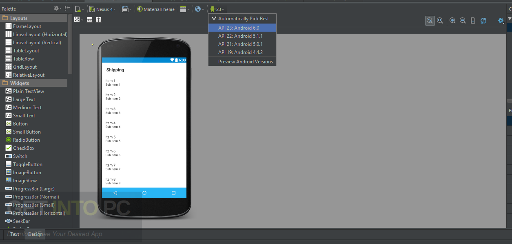
**Выбор версии ОС**

### Android телефон, Google аккаунт, Приложение Google Fit 

Вам необходимо создать аккаунт для вашего проекта. Зайти в него на телефоне и установить приложение `Google Fit` с помощью `Google Play Market`.

Далее запустите приложение и войдите под созданным аккаунтом. Теперь вам можно начать собирать данные, например, начав ходить по аудитории.  Проверьте, что данные корректно фиксируются в приложении `GoogleFit`.

**Приложение Google Fit**

## Установка программного обеспечения для разработки мобильных приложений на iOS 

Для того, чтобы разрабатывать мобильные приложения для iOS необходим компьютер старше 2013 года с операционной системой maсOS Mojave. На компьютер необходимо установить IDE для разработки iOS приложений – Xcode.

Xcode (версия 10) можно скачать в магазине App Store на компьютере с macOS Mojave :

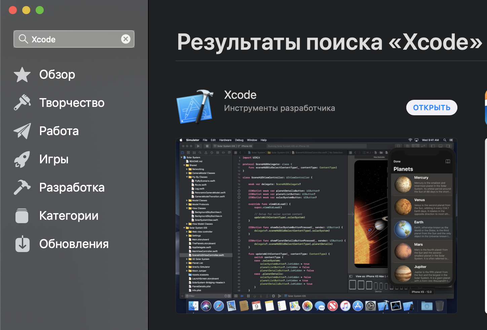

После установки, IDE отобразится в меню приложений:

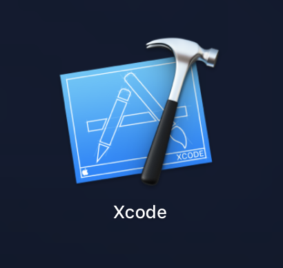

Прежде чем писать приложения под iOS и отправлять их на сервер, необходимо их подготовить и собрать при помощи iPhone.

Любые параметры, связанные со здоровьем в iPhone, как правило передаются в системное приложение Health, которое выглядит так:

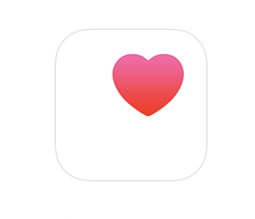

Подробное описание можно найти на сайте: [https://www.apple.com/ru/ios/health/](https://www.apple.com/ru/ios/health/)

Во время работы с нашим примером мы будем собирать следующие данные: пульс, медитацию, сон и отдых (в приложении называется осознанность), шаги, калории и другие параметры питания.

Чтобы собирать данные о пульсе необходимо:

1) Установить приложение

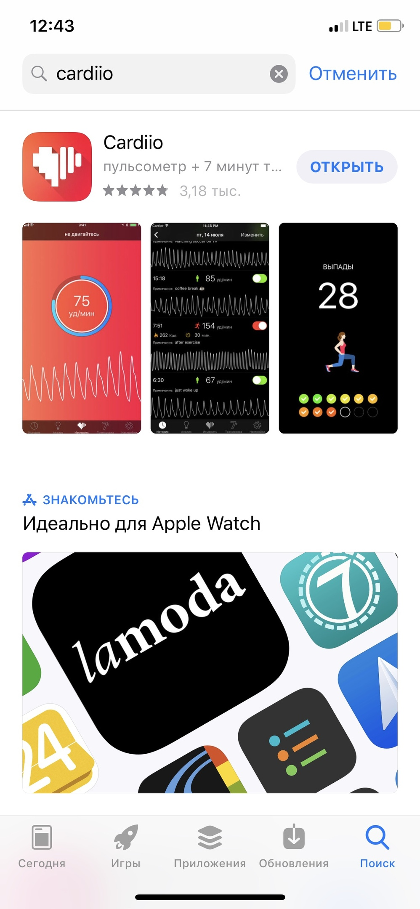

2) Зайти в приложение Cardiio

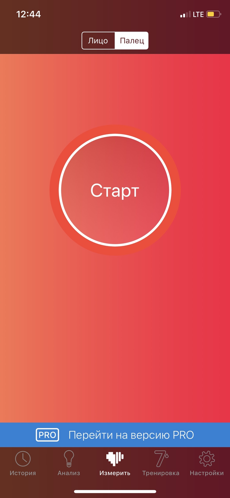

3) Зайти в настройки и проскроллить до секции Apple Health, после чего включить интеграцию с Health

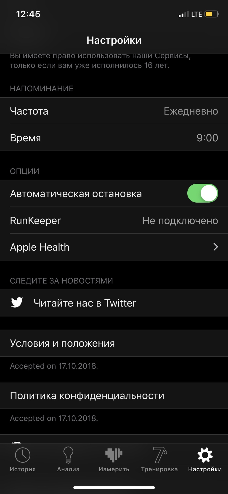

4) После измерения пульса, данные можно будет увидеть в Health

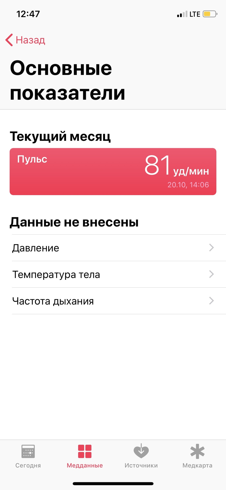

Чтобы собирать данные с шагомера и пройденного расстояния не нужно ставить никаких дополнительных приложений, все данные уже находятся в Health:

Чтобы собирать данные о питании необходимо проделать следующие шаги:

1) Установить приложение FatSecret

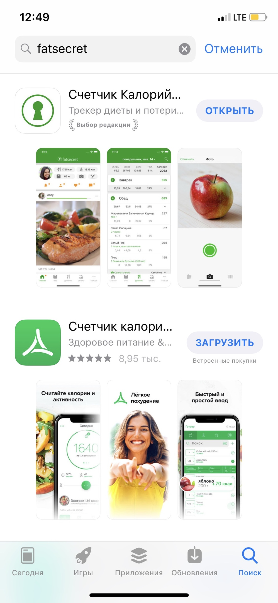

2) Зайти в настройки приложения и включить интеграцию с Health

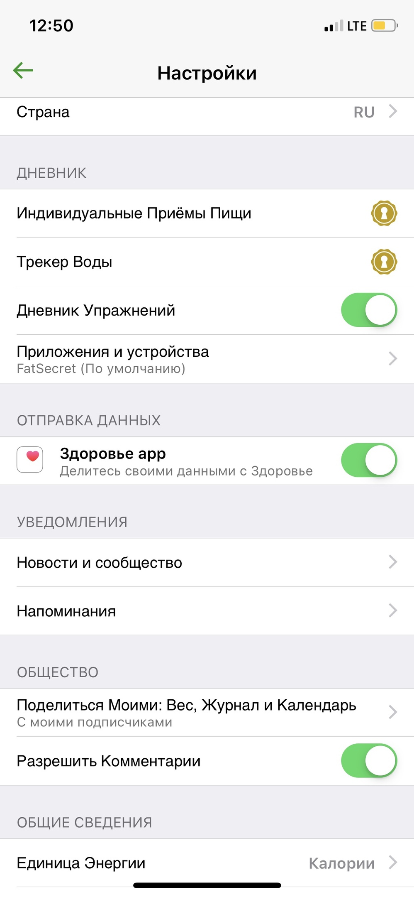

3) Добавить прием пищи в приложение

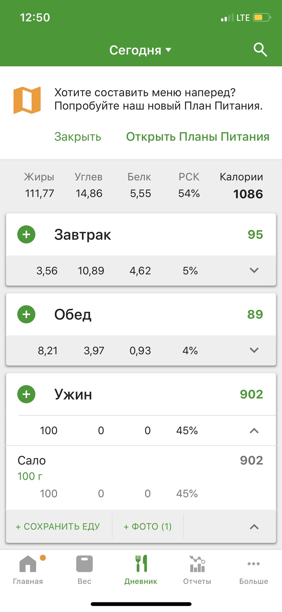

4) После этого вся информации о питании будет доступна в Health

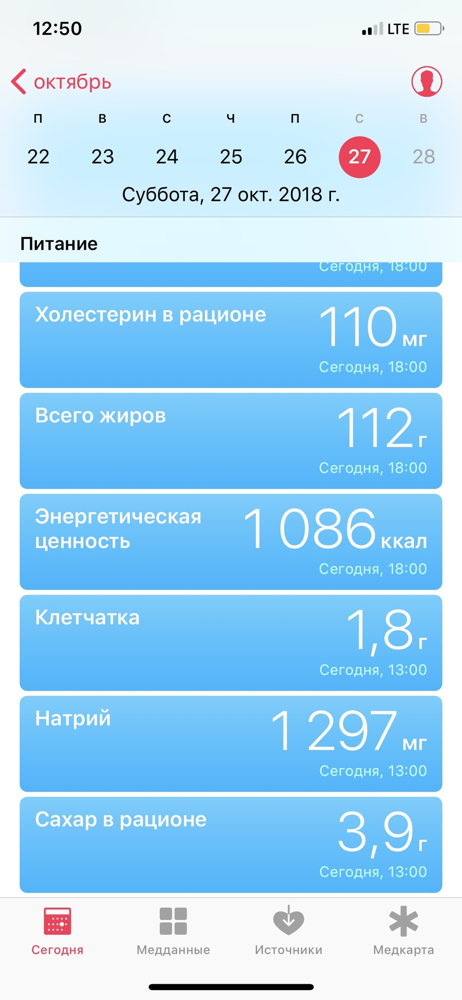

Для того чтобы собирать данные о медитации и отдыхе необходимо проделать следующие шаги:

1) Установить приложение Relax Melodies

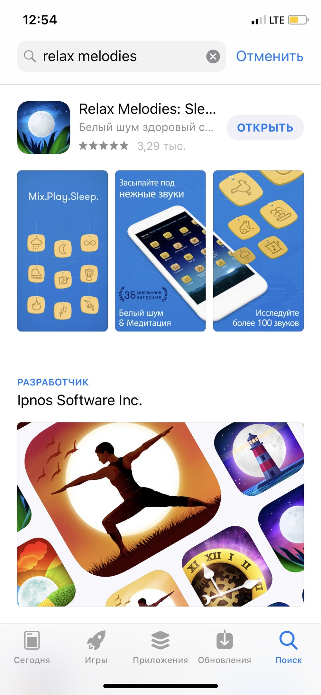

2) Включить в настройках интеграцию с Health

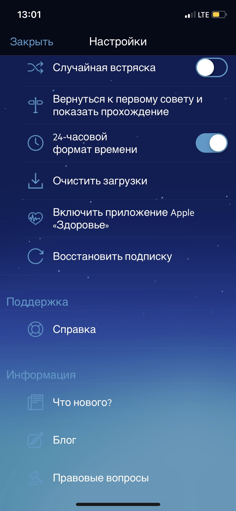

3) Далее после медитации под какую-нибудь бесплатную мелодию данные о медитации отправятся в Health

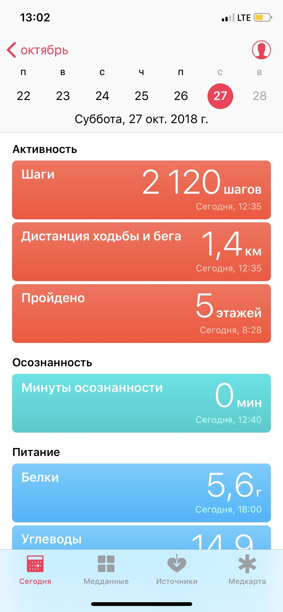
