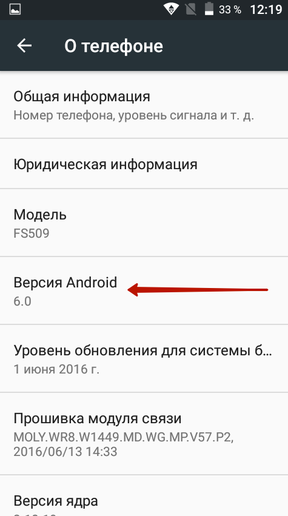
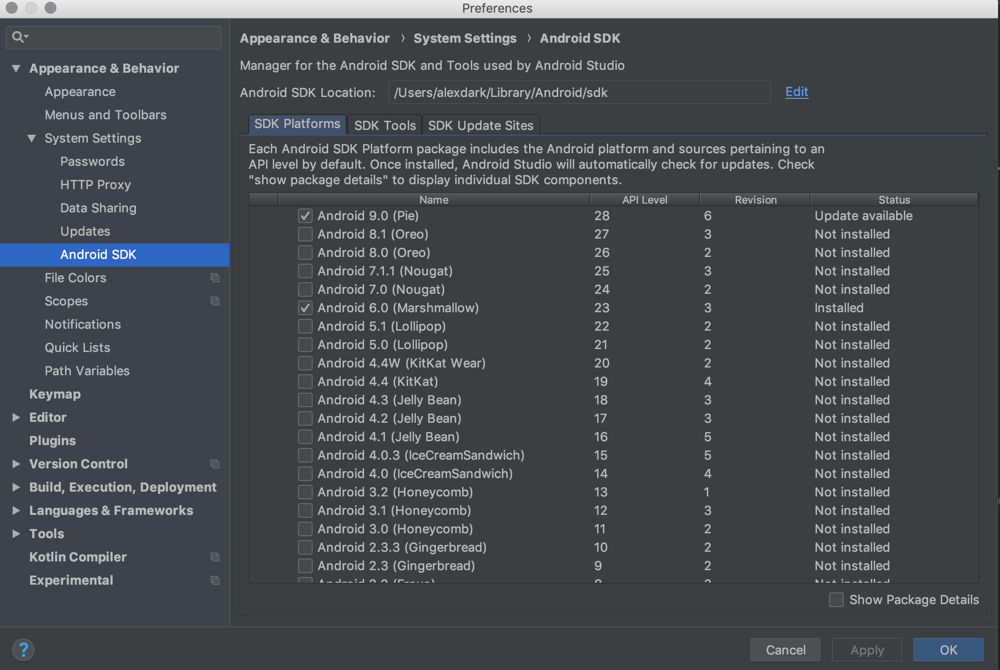
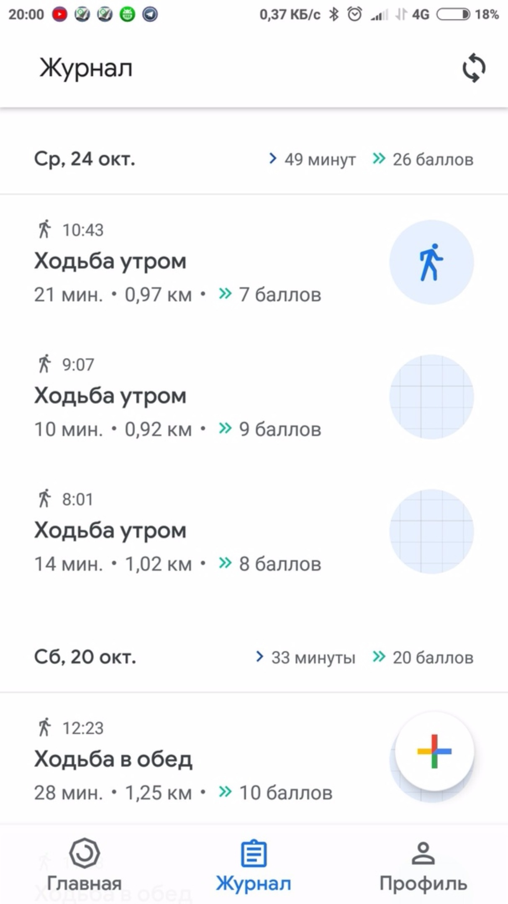

****
# День 2 

## Сбор фитнес и медицинских данных с помощью мобильных приложений 

В нашем хакатоне мы не имеем возможности использовать дорогостоящее медицинское оборудование, поэтому мы будет прототипировать систему на основе фитнес данных, полученных с помощью Ваших смартфонов.
В этой части нашего конкурса Вам предстоит разработать мобильное приложение, позволяющее собирать данные и передавать их в разрбатывемую систему через вычислительный хаб Raspberry Pi.

Вы можете использовать один из двух вариантов:

* Разработка в ОС Android.
* Разработка в IOS.

Подсистема сбора данных будет работать следующим образом. На смартфоне должны быть установлены приложения Google Fit и Apple Health, которые позволяют собирать различные фитнес-данные: активность, пройденный путь, количество шагов, пульс. Ондако при наличии специального оборудования и сенсоров, подключаемых к смарфону или передаваемых по беспроводным интерфейсам, эти приложения позволяют фиксировать и анализировать любые медицинские данные, а также передавать их по специальным API другим приложениям. Стоит отметить, что в настоящее время проекты динамично развиваются, поэтому не всегда представляется возможным быстро прототипировать проект из-зи наличия ошибок, отсутствия подробной документации и пр. ПОэтому мы поступим другим образом: мы будем использовать накопленную статистику приложений, для чего мы разработаем собственное мобильное приложения, агрегирующее даные медицинсокого характера. 

## Установка программного обеспечения для разработки мобильных приложений на OS Android 

Если вы решили делать приложение для Android, вам потребуются следующие компоненты:

* AndroidStudio
* Нужный нам SDK для AndroidStudio
* Android телефон
* Google аккаунт
* Приложение Google Fit
* Данные в Google Fit

Теперь рассмотрим подробнее о каждом элементе отдельно.

### Установка Android Studio 

Переходим на сайт [https://developer.android.com/studio/](https://developer.android.com/studio/)

Скачиваем и устанавливаем `Android Studio` на компьютер (желательно исопльзовать ОС Linux). В ходе установки загружаем все предлагаемые подпункты.

### Установка версии SDK 

Определяем версию ОС Вашего телефона.

**Распиновка Raspberry**

Запускаем студию и переходим в настройки. 

**Установка Android Studio**

Далее необходимо скачать нужный SDK из соответствующего раздела меню.

**Выбор версии ОС**

### Android телефон, Google аккаунт, Приложение Google Fit 

Вам необходимо создать аккаунт для вашего проекта. Зайти в него на телефоне и установить приложение `Google Fit` с помощью `Google Play Market`.

Далее запустите приложение и войдите под созданным аккаунтом. Теперь вам можно начать собирать данные, например, начав ходить по аудитории.  ПРоверьте, что данные корректно фиксируются в приложении `GoogleFit`.

**Приложение Google Fit**

**Продолжение следует ...**

